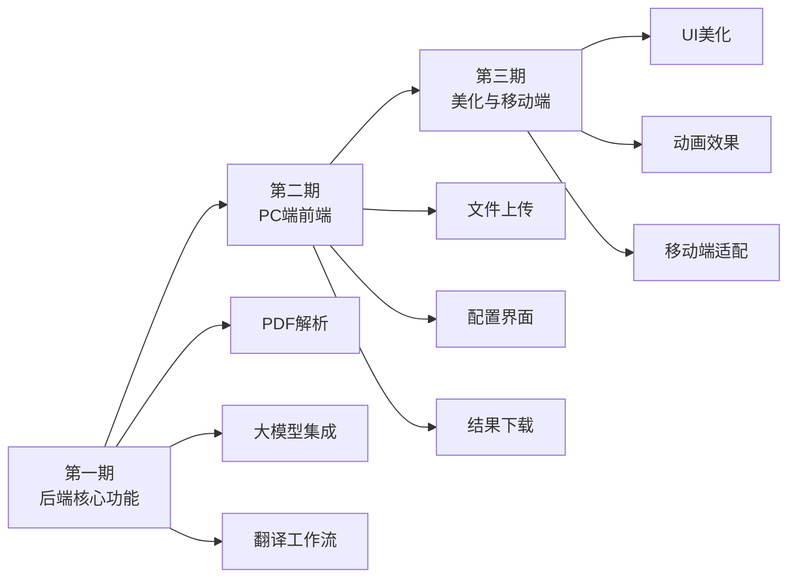

# TRPG PDF 翻译器 / PDF阅读器

针对桌上角色扮演游戏（Tabletop Role Playing Game，缩写： TRPG）的PDF、text等文本书籍，通过大语言模型翻译生成结果文件。

## PDF阅读器功能

本项目包含一个基于前后端分离架构的PDF在线阅读器。

### 技术栈

- **前端**: React + Vite + PDF.js
- **后端**: Python + Flask
- **架构**: 前后端分离

### 项目结构

```
trpg_pdf_translate/
├── backend/              # 后端服务
│   ├── app.py           # Flask应用主文件
│   ├── config.py        # 配置管理模块（环境变量加载）
│   ├── requirements.txt  # Python依赖
│   ├── llm/             # LLM 服务模块
│   │   ├── base.py      # LLM 抽象基类
│   │   ├── factory.py   # LLM 工厂类
│   │   ├── openai.py    # OpenAI 提供商
│   │   └── ollama.py    # Ollama 提供商
│   ├── utils/           # 工具模块
│   └── pdfs/            # PDF文件存储目录
└── frontend/            # 前端页面
    ├── src/             # React源代码
    │   ├── components/  # React组件
    │   ├── App.jsx      # 主应用组件
    │   ├── main.jsx     # 入口文件
    │   └── *.css        # 样式文件
    ├── index.html       # HTML模板
    ├── package.json     # 前端依赖配置
    └── vite.config.js   # Vite配置
```

### 快速开始

#### 1. 安装后端依赖

```bash
cd backend
pip install -r requirements.txt
```

#### 2. 启动后端服务

```bash
cd backend
python app.py
```

后端服务将在 `http://localhost:5000` 启动

#### 3. 安装前端依赖

```bash
cd frontend
npm install
```

#### 4. 添加PDF文件

将PDF文件放入 `backend/pdfs/` 目录下

#### 5. 启动前端开发服务器

```bash
cd frontend
npm run dev
```

前端服务将在 `http://localhost:8000` 启动

#### 6. 访问应用

在浏览器中打开 `http://localhost:8000` 即可使用PDF阅读器

### API接口

#### LLM 服务配置

通过环境变量配置 LLM 服务，创建 `.env` 文件：

```bash
# 选择 LLM 提供商: openai 或 ollama
LLM_PROVIDER=openai

# OpenAI 配置
OPENAI_API_KEY=your_api_key_here
OPENAI_BASE_URL=https://api.openai.com/v1
OPENAI_MODEL=gpt-4o-mini

# Ollama 配置（本地使用）
# LLM_PROVIDER=ollama
# OLLAMA_BASE_URL=http://localhost:11434
# OLLAMA_MODEL=llama3.2
```

支持的提供商：
- **OpenAI** - OpenAI API 及兼容的 API（Azure OpenAI、自定义 OpenAI 兼容 API）
- **Ollama** - 本地 Ollama 服务

---

### API 接口

#### 获取PDF文件列表
```
GET http://localhost:5000/api/pdfs
```

返回示例：
```json
{
  "success": true,
  "count": 1,
  "files": [
    {
      "filename": "example.pdf",
      "size": 12345,
      "url": "/api/pdf/example.pdf"
    }
  ]
}
```

#### 下载指定PDF文件
```
GET http://localhost:5000/api/pdf/<filename>
```

### 功能特性

✅ PDF文件列表展示
✅ 在线PDF预览和翻页
✅ 响应式设计
✅ 跨域支持（CORS）
✅ 文件大小显示
✅ 页码导航
✅ React组件化开发
✅ Vite快速热更新

### 注意事项

1. 确保后端服务已启动（端口5000）
2. 将PDF文件放在 `backend/pdfs/` 目录下
3. 需要安装Node.js和npm
4. 首次运行需要执行 `npm install` 安装依赖
5. 开发环境支持热更新，修改代码后会自动刷新页面

### 构建生产版本

```bash
cd frontend
npm run build
```

构建后的文件将在 `frontend/dist` 目录下，可以部署到任何静态文件服务器。

---

## 开发计划

### 📅 第一期：核心后端功能

#### 后端开发
- 🔌 **PDF 解析 API 接口** - 集成 PDF 解析功能，支持文档文本提取
- 🤖 **通用大模型 API 配置** - 支持 OpenAI、Ollama 等主流大模型平台协议
- 📝 **智能翻译工作流**
  - 自动提取文档中的专有名词
  - 自动汇总生成译名表
  - 使用大模型进行文本翻译
  - 根据译名表更新译文结果
  - 导出译文结果（支持单语、双语对照格式）
  - 支持导出为 Markdown、PDF 等格式

---

### 📅 第二期：PC 端前端开发

#### 前端功能
- 📤 **PDF 文件上传** - 支持文件拖拽上传和批量上传
- 📚 **译名表配置** - 可视化译名表编辑界面
- 🔑 **大模型 API 配置** - 灵活的 API 参数设置界面
- ⚙️ **PDF 解析配置** - 可自定义解析参数
- 📥 **结果文件下载** - 支持多种格式的翻译结果下载

---

### 📅 第三期：界面优化与移动端支持

#### 界面美化
- 🎨 **UI/UX 优化** - 提升整体视觉体验
- ✨ **交互动画** - 添加流畅的过渡效果
- 🌙 **主题切换** - 支持亮色/暗色主题

#### 移动端适配
- 📱 **响应式设计** - 完美适配手机和平板设备
- 👆 **触控优化** - 针对触摸屏优化的交互体验
- 📐 **自适应布局** - 根据屏幕尺寸自动调整界面布局

---

### 🎯 技术路线图



### 📊 进度追踪

| 阶段 | 状态 | 完成度 | 预计完成时间 |
|------|------|--------|--------------|
| 第一期：后端核心功能 | 🔄 进行中 | 0% | - |
| 第二期：PC 端前端开发 | ⏳ 待开始 | 0% | - |
| 第三期：界面优化与移动端 | ⏳ 待开始 | 0% | - |

---

## 贡献指南

欢迎贡献代码和建议！请遵循以下步骤：

1. Fork 本仓库
2. 创建特性分支 (`git checkout -b feature/AmazingFeature`)
3. 提交更改 (`git commit -m 'feat: Add some AmazingFeature'`)
4. 推送到分支 (`git push origin feature/AmazingFeature`)
5. 开启 Pull Request

## 许可证

本项目采用 MIT 许可证。详情请参阅 LICENSE 文件。
